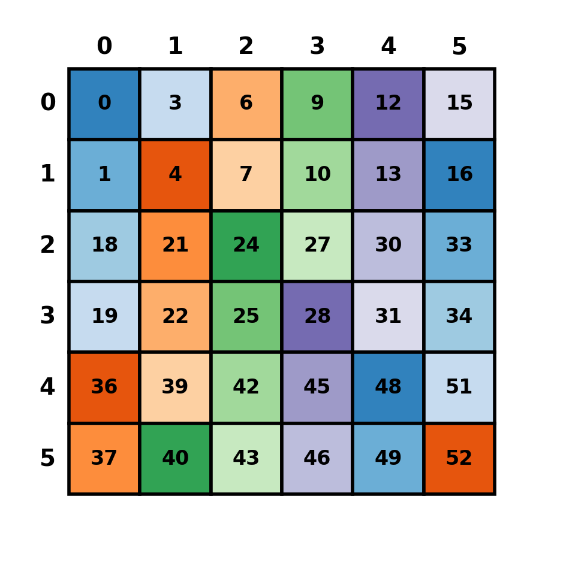
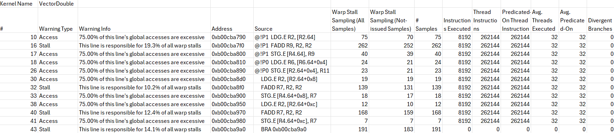

# Hilt: A Python package for CuTeDSL utilities.

## Installation

```bash
git clone --recurse-submodules https://github.com/HanGuo97/hilt
cd hilt
pip install -e .
```

## Eager Mode

Hilt provides eager-mode-like execution of (some) CuTeDSL instructions. While runtime values are dummy placeholders, this feature serves as a useful meta-programming tool by JIT-compiling every instructions and handling data structure serialization/deserialization.

The primary use case (for myself) is prototyping layout algebra operations. Hilt also includes a fully Python-based layout visualization tool inspired by Horace's [visualizer](#1).

```diff
- import cutlass.cute as cute
+ import hilt.eager.api as cute
```

```python
# (2,3):(1,3)
layout0 = cute.make_layout(shape=(2, 3), stride=(1, 3))
# (3,2):(2,1)
layout1 = cute.make_layout(shape=(3, 2), stride=(2, 1))
# ((2,3),(3,2)):((1,18),(3,9))
layout2 = cute.blocked_product(layout0, layout1)
# (3,2):(3,1)
layout3 = cute.composition(layout0, layout1)
# 2:3
layout4 = cute.right_inverse(layout3)

layout0.visualize(dpi=200)
layout1.visualize(dpi=200)
layout2.visualize(dpi=200)
layout3.visualize(dpi=200)
layout4.visualize(dpi=200)
```
For example, visualizing `layout2` produces:



Eager-mode also supports Tensor operations (SSA), though with some limitations.
```python
import torch
from hilt.eager.tensor import from_torch

tensor = torch.randn(7, 15, dtype=torch.bfloat16)
# tensor<ptr<bf16, gmem> o (7,15):(15,1)>
cute_tensor = from_torch(tensor, memspace="gmem")
# tensor<ptr<f16, rmem> o (7,15):(1,7)>
cute_fragment = cute.make_fragment_like(cute_tensor, cute.Float16)
# tensor_value<vector<105xf16> o (7, 15)>
cute_ssatensor = cute_fragment.load()
```


## Profile-Kernel

A CLI tool to profile CUDA kernels using NVIDIA Nsight Compute, extract source-level performance information, and automatically highlight performance bottlenecks (e.g. excessive memory access or warp stalls).

```bash
profile-kernel \
  --ncu_path /path/to/ncu \
  --exe_path /path/to/python \
  --filepath my_kernel.py \
  --output_filename output \
  [--filter access|stall|warning]  # optional
```



## Printing Utilities
```python
runtime_print(x: cute.Tensor | cute.TensorSSA | object, tid: int = 0, bid: int = 
0) -> None
    """
    printing function that prints only from thread `tid` in block `bid` and handles different object types:
    - cute.Tensor: Uses print_tensor()
    - cute.TensorSSA: Converts to fragment then prints
    - Other objects: Prints type and value
    """
```

## Math Utilities
We included several math functions in `hilt/math_utils.py` that work with both `cute.TensorSSA` as well as scalar values:

- `exp(x)`
- `log(x)`
- `rsqrt(x)`
- etc

These functions automatically dispatch to the appropriate implementation based on the input type.